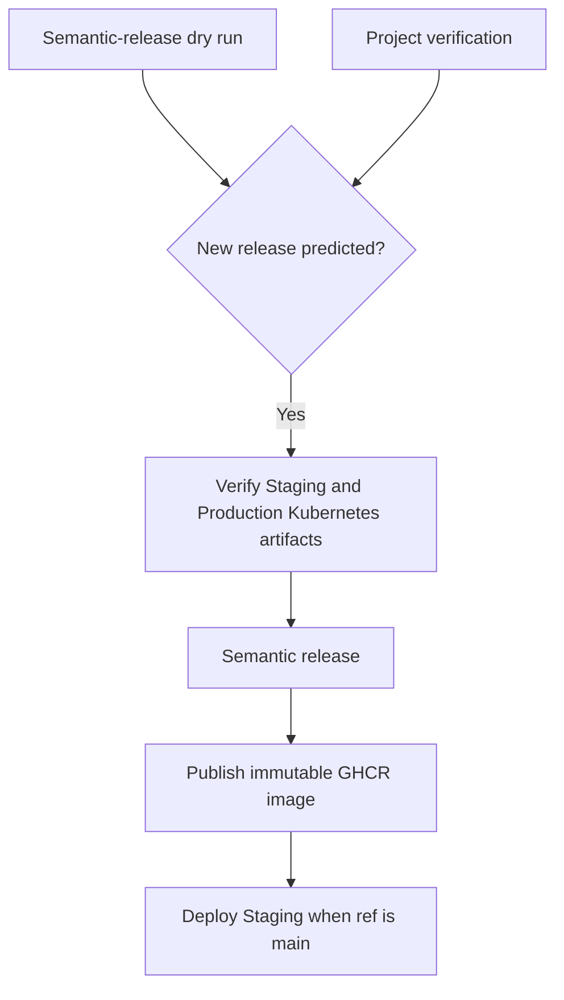

# Overlay Aspire Kubernetes Deployment Design

## Purpose

Replace the Overlay demo's Coolify deployment with an Aspire-defined Kubernetes deployment.
The deployment model must preserve immutable semantic-release image tags, provide isolated Staging and Production workloads, and keep Production promotion manual.
The server host must adopt the current Arkanis Common service defaults so application health paths, Kubernetes probes, and OpenTelemetry instrumentation share one contract.

## Scope

This design adds `Arkanis.Overlay.Host.Aspire` under the solution's `Apps` folder.
It adds Kubernetes publishing and deployment configuration for the existing server image.
It updates the server host's health and observability setup.
It replaces the Coolify-specific GitHub Actions deployment paths.
It adds fixture-only Aspire publish integration tests.

This design does not replace the SQLite persistence model with a network database.
This design does not introduce an artificial application secret when the running application currently has no secret-valued deployment configuration.
This design does not create an unverified cluster OTLP receiver endpoint.

## Deployment Environments

The AppHost will use the same deployment-environment helpers and configuration layering as CitizenId.
It will call `builder.Environment.GetDeploymentEnvironment()` after creating the distributed application builder.
When a deployment environment exists, it will add `appsettings.{Class}.json` and `appsettings.{Class}.{EnvironmentType}.json` as optional non-reloading configuration sources.
For Kubernetes deployments this resolves the shared `appsettings.Kubernetes.json` file followed by the target-specific `appsettings.Kubernetes.Staging.json` or `appsettings.Kubernetes.Production.json` file.
It will then add the ordinary environment-name file, `appsettings.local.json`, and environment variables, matching the CitizenId ordering.

The automatic deployment environments are defined below.

| Environment | Aspire environment selection | Namespace | Hostname | Deployment policy |
|---|---|---|---|---|
| Staging | Kubernetes Staging deployment environment | `arkanis-overlay-staging` | `overlay.arkanis.dev` | Automatically deploy a `main` release only |
| Production | Kubernetes Production deployment environment | `arkanis-overlay-production` | `overlay.arkanis.space` | Manual promotion only |

The generated Helm releases use the namespace as their release name.
Both application environments run through the existing cluster-connected `arkanis-runners` GitHub Actions runner topology.
The dedicated infrastructure staging cluster remains reserved for infrastructure validation and is not an application deployment target.

## Application Model

The AppHost will use `TargetedResourceFactory` so local development and Kubernetes publishing use one logical resource with target-appropriate implementations.
For local Aspire runs, the target is `AddProject<Projects.Arkanis_Overlay_Host_Server>("overlay")`.
For Kubernetes publishing, the target is a prebuilt `ghcr.io/arkaniscorporation/arkanisoverlay` container using the configured image tag.
The AppHost does not build or publish a server image.
The CI image-publication job remains the authority for that image.

The Kubernetes target exposes HTTP port 8080 and creates an internal ClusterIP service.
The target creates a standard public Kubernetes Ingress with the environment-specific hostname and Let’s Encrypt production ClusterIssuer configuration.
The target references the cluster-provisioned `ghcr-pull` image pull secret.
The AppHost does not create that Secret because the cluster External Secrets configuration owns it.

The common Kubernetes configuration defines the `onepassword-connect` ClusterSecretStore.
The AppHost calls `Use1PasswordAsync("arkaniscorp.1password.com")` only when it is not publishing or deploying to Kubernetes.
This preserves the established local resolution path for future `op://` parameters without resolving secrets during Kubernetes artifact generation.
No parameter or ExternalSecret is added until Overlay gains an actual sensitive deployment input.
When one is required, it must be represented as an Aspire parameter and mapped with `MapOnePasswordParameter` rather than written into source, a Docker build argument, or a generated manifest.

## SQLite Persistence And Workload Safety

Overlay persists data through the existing SQLite `OverlayDbContext`.
Each environment therefore receives one independent RWO PersistentVolumeClaim using the replicated `longhorn-ext4-r2` storage class and an initial 1 GiB request.
The claim is mounted at `/var/lib/overlay`.
The container receives `XDG_DATA_HOME=/var/lib/overlay`, preserving the application's existing `LocalApplicationData/ArkanisOverlay/data` database path beneath the mounted volume.

The workload runs exactly one replica.
The Deployment uses the `Recreate` strategy so an update never creates a second SQLite writer or attempts concurrent attachment of the RWO claim.
Horizontal autoscaling is intentionally absent.
The server image and pod security context will run as a non-root user with ownership or group access to the mounted data directory.

The initial resource baseline is a 256 MiB memory request, 512 MiB memory limit, and 50m CPU request without a CPU limit.
This follows the cluster convention of avoiding CPU throttling while retaining memory containment.
Production resource values must be reviewed after workload metrics are available.

## Standardized Health And Observability

The server host will replace its custom `UseCommonServices` logging path and direct `MapHealthChecks("/healthz")` mapping with `Arkanis.Common.Aspire.ServiceDefaults`.
It will call `builder.AddServiceDefaults()` before application-specific service registration.
It will call `app.MapDefaultEndpoints()` after building the application.

The resulting endpoint contract is:

| Endpoint | Health category | Meaning |
|---|---|---|
| `/healthz/alive` | Liveness | The server process remains alive |
| `/healthz/ready` | Readiness | The server can accept traffic and its required SQLite database is available |
| `/healthz/startup` | Startup | Startup migrations and database initialization have completed |

The host will add an `OverlayDbContext` database health check tagged with `HealthCheckTags.Category.Readiness`, `HealthCheckTags.Category.Startup`, `HealthCheckTags.Type.Dependency`, and `HealthCheckTags.Dependency.Database`.
The database check runs after the existing infrastructure service registration makes the context available.
The existing asynchronous migration remains before `app.Run()`, so a pod cannot serve requests until migrations complete.

Service Defaults configures OpenTelemetry logs, ASP.NET Core and HTTP-client tracing, runtime and HTTP metrics, service discovery, and standard HTTP resilience.
It excludes requests below `/healthz` from ASP.NET Core trace generation.
It exports telemetry only when `OTEL_EXPORTER_OTLP_ENDPOINT` is supplied.
No Kubernetes endpoint is configured in this change because the current infrastructure configuration does not identify a supported cluster OTLP receiver.
Local Aspire execution retains its dashboard telemetry through the normal Aspire-provided OTLP configuration.

The AppHost will use `AddAllHealthCheckProbes` from `Arkanis.Aspire.Hosting.Extensions.Kubernetes` on the targeted server resource.
The extension emits startup, liveness, and readiness probes using the same Common-library path constants.
The probe options use a 10-second period and five-second timeout.
The generated HTTP probe scheme must be normalized to uppercase `HTTP` because Kubernetes validates enum values case-sensitively.

## Release And Deployment Flow

`release.config.mjs` will identify this repository as `ArkanisCorporation/ArkanisOverlay`.
Its `main` branch produces the `staging` channel with the `dev` prerelease identifier.
The existing alpha, beta, release-candidate, stable, and `ci` release channels retain their semantic-release behavior.

Only a release generated from `refs/heads/main` automatically deploys to Staging.
No branch automatically deploys to Production.
Alpha, beta, and release-candidate builds may publish their normal release artifacts but do not trigger either Kubernetes deployment.

The automatic flow is:

Kubernetes artifact verification runs only when dry-run semantic release predicts a new version.
It renders both Staging and Production configuration to validate both deployment models without contacting a cluster.
The prediction supplies the dry-run immutable tag only for verification.
Release, image publication, and deployment consume the actual semantic-release outputs.

The manual path accepts a selected target environment and an explicit immutable image tag.
It does not reject a tag because of its source branch or prerelease channel.
The selected `Staging` or `Production` GitHub Environment remains the authorization and protection boundary.
This permits an operator to intentionally promote any appropriate released image, including a `main` dev image, while leaving that action auditable and manual.

The automatic and manual workflows use `wf-verify-deploy-k8s-aspire.yml@v1` and `wf-deploy-k8s-aspire.yml@v1`.
They use `runs-on-self-hosted: true`, the existing `arkanis-runners` runner selection, and Kubernetes schema version `1.36.4`.
The shared deployment workflow receives no kubeconfig secret because the self-hosted runner already has the intended cluster service-account context.

The former Coolify caller workflows, Coolify environment inputs, and Coolify-only secret forwarding are removed after the Kubernetes path is validated.
The repository documentation changes the public production URL to `https://overlay.arkanis.space`.

## Fixture-Isolated Artifact Integration Tests

The new `Arkanis.Overlay.Host.Aspire.IntegrationTests` project will run `dotnet tool run aspire -- publish` against the AppHost.
It will follow CitizenId’s fixture pattern by setting `DOTNET_CONTENTROOT` to `tests/Arkanis.Overlay.Host.Aspire.IntegrationTests/Fixtures/AspirePublish`.
The fixture directory contains only synthetic `appsettings.json`, `appsettings.Kubernetes.Staging.json`, and `appsettings.Kubernetes.Production.json` files.
It does not read the AppHost's production configuration files.

Fixture configuration uses invalid non-routable hostnames such as `overlay.fixture.invalid`, fixture namespaces, fixture TLS names, and `v0.0.0-fixture` image tags.
The tests publish Staging and Production artifacts into independent temporary output paths and parse the emitted Helm YAML.
They do not run `aspire deploy`, Helm upgrade, kubectl, or any command that can mutate Kubernetes.

The tests assert all of the following:

- The synthetic namespace, image tag, public ingress host, and TLS secret are emitted.
- The image reference is immutable and the pod uses `ghcr-pull`.
- The SQLite PersistentVolumeClaim is RWO, uses the configured storage class, and mounts at `/var/lib/overlay`.
- `XDG_DATA_HOME` points to the persistent mount.
- The deployment has one replica and a `Recreate` strategy.
- Startup, liveness, and readiness probes use `/healthz/startup`, `/healthz/alive`, and `/healthz/ready` with uppercase `HTTP` schemes.
- No raw Kubernetes Secret manifest or literal `op://` value is emitted.
- No real namespace, `overlay.arkanis.dev`, or `overlay.arkanis.space` appears in fixture-generated output.

## Dependencies And Repository Structure

The solution receives the AppHost in the existing `Apps` folder and the artifact integration test project in the existing `Tests` folder.
Central package management adds current compatible versions of `Arkanis.Common.Aspire.ServiceDefaults`, `Arkanis.Aspire.Hosting.Extensions.Kubernetes`, `Arkanis.Hosting.Extensions.1Password`, `Aspire.Hosting.AppHost`, `Aspire.Hosting.Kubernetes`, `Microsoft.Extensions.Diagnostics.HealthChecks.EntityFrameworkCore`, and `YamlDotNet`.
The repository adds the `github.com-ArkanisCorporation` NuGet source configuration required to restore the private Arkanis packages in local and CI environments.
CI supplies private source authentication through the existing `NUGET_AUTH_JSON` shared-workflow contract and grants `packages: read` only where restore requires it.
The .NET tool manifest adds the Aspire CLI used by shared Kubernetes verification and deployment workflows.

## Acceptance Criteria

The AppHost can run the server project locally and publish both Kubernetes environments from their explicit configuration files.
Staging renders and deploys only automatically from a new `main` release.
Production can be deployed only through the protected manual workflow.
The deployed image tag comes from the actual semantic-release result and is never replaced with a mutable alias for deployment selection.
The server exposes the shared Common health endpoints and emits the matching three Kubernetes probes through the Kubernetes extension.
Fixture integration tests never render real Staging or Production values.
No Coolify workflow remains after the Aspire Kubernetes deployment path is adopted.
