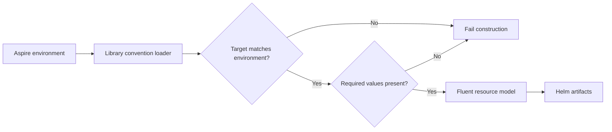

# Overlay Aspire Configuration Safety Design

## Goal

Adopt `Arkanis.Aspire.Hosting.Extensions.Kubernetes` `1.0.0-dev.22` and reduce the number of independent names and configuration sources that can produce an incorrect Kubernetes artifact.
Keep local development, Staging deployment, Production deployment, and publish tests distinct.

## Configuration and target selection

Use the library's `AddDeploymentEnvironmentConfiguration` and `IsKubernetesDeployment` methods.
Remove the AppHost's duplicate target parser and manual JSON layering.
Load `appsettings.local.json` for local development only.
For Kubernetes targets, require a qualified `Kubernetes-*` environment and a `Kubernetes:Target` value exactly equal to its Aspire environment name.
Require the namespace, image repository and tag, Ingress host, TLS secret, and cluster issuer before building the deployment model.
Reject an explicitly disabled Ingress.
Missing or mismatched values fail AppHost construction.
Keep the image repository in base configuration and the target, namespace, host, TLS secret, and cluster issuer in target-specific files.
The image tag comes from `Kubernetes__Images__Tag` in deployment workflows and from synthetic fixture JSON in tests.
Remove the implicit mutable image-tag defaults and the separate `VERSION_TAG` precedence path.

## Kubernetes resource model

Keep the existing targeted local project and Kubernetes prebuilt container arrangement.
Attach Ingress directly to the selected compute resource with the resource-local `WithKubernetesIngress` builder.
Use the conventionally derived `overlay-ingress-http` name and bind its target-specific host and TLS settings from configuration.
Attach a new PVC and its mount together through `WithNewKubernetesPersistentVolumeClaim`.
Keep the one-replica `Recreate` workload, non-root security context, image pull secret, and three health probes.
Define the SQLite mount path once in AppHost code and use it for the volume and `XDG_DATA_HOME` environment variable.
Keep `ReadWriteOnce`, `1Gi`, and `longhorn-ext4-r2` as explicit workload invariants in the fluent claim builder.
Remove the unused External Secrets registration and its settings because this AppHost declares no secret projection.
There is no current cross-service dependency to convert to the new reference-aware environment-value API.
When one is added, it must use a resource reference rather than a manually assembled Service name or port.

## Test isolation

Publish tests use `Kubernetes-Test-Staging` and `Kubernetes-Test-Production` only.
Their separate fixture files are named `appsettings.Kubernetes.Test-Staging.json` and `appsettings.Kubernetes.Test-Production.json` and contain matching `Kubernetes:Target` values.
The fixture content root contains synthetic namespace, image, Ingress, and TLS values only.
The claim specification is code-defined and identical for real and fixture artifacts.
The workload application environment in fixtures is `Testing`.
A fixture preflight rejects inherited `Kubernetes__*` environment overrides before constructing or publishing the model.
A real target name against the fixture root has no matching target identity and fails.
A test target against the AppHost content root has no matching target identity and fails.
Tests do not use the AppHost content root to verify that rule; a synthetic mismatched target test exercises the same validation.
Tests never invoke `aspire deploy`, Helm, or `kubectl`.

## Verification

First add tests for target mismatch, missing required values, and fixture-only model selection.
Publish both test targets to temporary directories and inspect the generated workload, claim, and Ingress manifests.
Inspect Helm values and the Deployment's ConfigMap reference for application environment variables.
Assert that no real namespace or hostname appears in fixture artifacts.
Build the AppHost and run the publish tests without a live Kubernetes context.
Review the shared CI caller inputs, which continue to select `Kubernetes-Staging` and `Kubernetes-Production` and provide an immutable semantic-release image tag.
Do not alter the shared deployment workflow contract or run a deployment.

## Scope and constraints

Work in the current branch and worktree.
Preserve unrelated staged screenshots and untracked files.
Do not change the project's SDK pin as part of this refactor.
If local verification cannot use the pinned `10.0.301` SDK, report that limitation separately from source or test failures.
